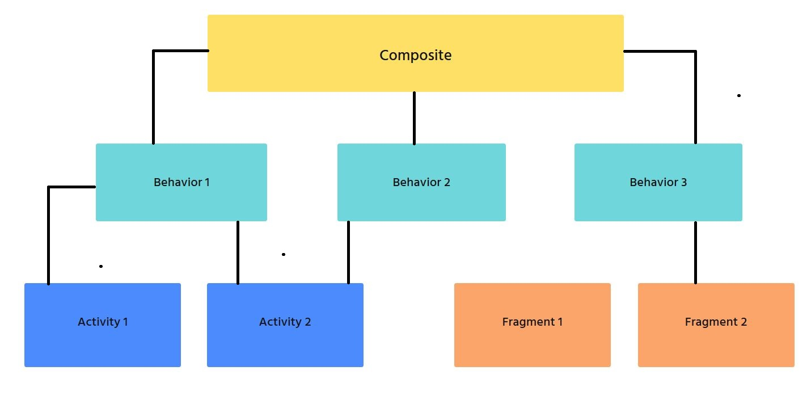

# CompositeAndroid
Use composite instead of inheritance for Activity, Fragment...

Author: **Minh Nguyen**

## Techniques

* [x] Composite framework
* [x] Dagger
* [x] Color reveal animation

## Goal
Instead of using BaseActivity (with cause redundant functions), use Composite framework to indicates functions that ChildActivites need to have.

